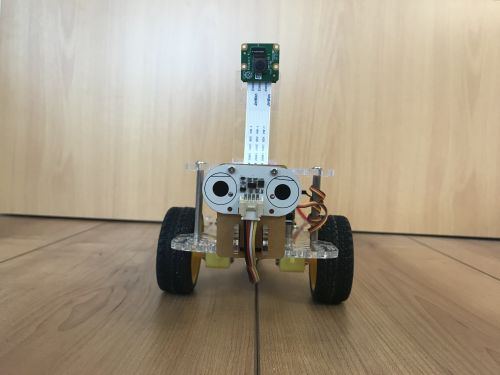
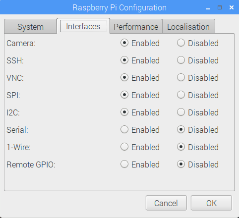
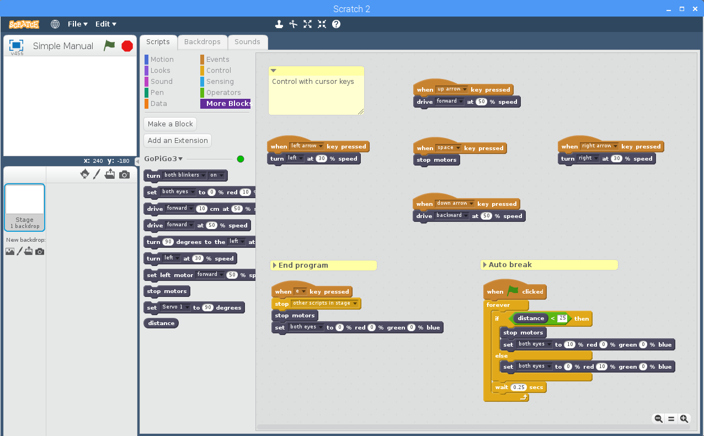
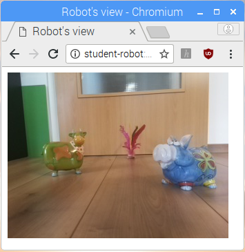

# GoPiGo Scratch Extension

Control the Raspberry Pi expansion board *[GoPiGo3](https://www.dexterindustries.com/gopigo3/)* from the programming language *[Scratch](https://en.wikipedia.org/wiki/Scratch_(programming_language))*. *[ScratchX](http://scratchx.org/#scratch)* and the *Scratch 2 Offline Editor* are supported.

The GoPiGo3 is made by [Dexter Industries](https://www.dexterindustries.com/). Scratch was developed by the [MIT Media Lab](https://www.media.mit.edu/).



## Features

The following GoPiGo3 or Raspberry Pi features are supported by the Scratch extension:

* Blinkers (two red LED lights at the front of the GoPiGo3 board)
  * turn on/off individually or both at the same time
* Eyes (two RGB LED lights on top of GoPiGo3 board)
  * control individually or both eyes at the same time
  * set color and brightness by specification of RGB components
* GoPiGo3 motion control
  * drive forward/backward specific distance at specific speed and then stop
  * drive forward/backward at specific speed until another motor command is sent
  * turn given degrees to the left/right at specific speed and then stop
  * turn to the left/right at specific speed until another motor command is sent
  * set speed and direction for left and right motor individually and maintain until another motor command is sent
  * stop motors
* Servo control
  * set position (0..180 degrees) for servo motors connected to Servo 1 or Servo 2 connectors
* Distance sensor
  * read distance in cm
* Video streaming from camera module
  * Stream robot's view to your browser

## Compatibility

Tested with
* *[Raspberry Pi 3 Model B](https://www.raspberrypi.org/products/raspberry-pi-3-model-b/)*
* *[Raspberry Pi Camera Module v2](https://www.raspberrypi.org/products/camera-module-v2/)*
* *[GoPiGo3](https://www.dexterindustries.com/gopigo3/)*
* *[Servo](https://www.dexterindustries.com/shop/servo-package/)*
* *[Distance Sensor](https://www.dexterindustries.com/shop/distance-sensor/)*
* *Rasbian Stretch with Desktop* Version *April 2018* with latest updates as of 22-Nov-2018
* *Python libraries for GoPiGo3* as of 03-May-2018
* *ScratchX* as of 18-Nov-2018
* *Scratch 2 Offline Editor* (as it comes with Raspbian, as of 22-Nov-2018)

## How the extension works

This extension comes with a server that needs to run on the Raspberry Pi that has the GoPiGo3 board attached to it. The server exposes expansion board and camera functionality through HTTP endpoints. It uses the GoPiGo3 Python libraries to control the board, and the PiCamera library to expose the video stream. In Scratch an extension needs to be loaded. The extension exposes board functionality as additional Scratch blocks. Scratch can be running on the same computer as the server, or a different one. It needs to be able to connect to the server.

## Server Installation

### Rasbian

Download and install the latest [Rasbian](https://www.raspberrypi.org/downloads/raspbian/).

Update Rasbian with

```
pi@student-robot:~ $ sudo apt update
pi@student-robot:~ $ sudo apt upgrade
```

### Enable SPI and I2C interfaces

The *Serial Peripheral Interface* (SPI) bus is used for communication between Raspberry Pi and GoPiGo3 board.

The *Inter-Integrated Circuit* (I2C) bus can be used to connect I2C devices (e.g. distance sensor) to the Raspberry Pi. The GoPiGo3 board provides two I2C [Grove](http://wiki.seeedstudio.com/Grove_System/) connectors that are directly connected to the Raspberry Pi.

Per default the SPI and I2C interface are disabled in Raspbian. To enable the interfaces go to menu *Preferences* > *Raspberry Pi Configuration*, tab *Interfaces*. Make sure the interfaces *SPI* and *I2C* are enabled.



### Python libraries for GoPiGo3 and sensors

Install GoPiGo3 libraries, then reboot Raspberry Pi. See https://github.com/DexterInd/GoPiGo3 for details.

```
pi@student-robot:~ $ curl -L https://dexterindustries.com/update_gopigo3 | bash
pi@student-robot:~ $ sudo shutdown -r now
```

Install support for sensors. See https://github.com/DexterInd/DI_Sensors for details.

```
pi@student-robot:~ $ curl -L https://dexterindustries.com/update_sensors | bash
```

### GoPiGo3 Server

Download the Scratch extension.

```
pi@student-robot:~ $ git clone https://github.com/markokimpel/gopigoscratchextension.git ~/gopigoscratchextension/
```

Make the GoPiGo3 Server start automatically when Raspbian starts.

```
pi@student-robot:~ $ sudo ~/gopigoscratchextension/gpg3server/install_service.sh
pi@student-robot:~ $ sudo systemctl enable gpg3server
pi@student-robot:~ $ sudo systemctl start gpg3server
```

Alternatively you can start the service manually every time you need it.

```
pi@student-robot:~ $ ~/gopigoscratchextension/gpg3server/run.sh
Server listening at 0.0.0.0:8080

GPG3 Server homepage : http://<your_ip_addr>:8080/
Scratch extension URL: http://<your_ip_addr>:8080/scratch_extension.js

Press Ctrl-C to stop server
```

## Use Scratch

The GoPiGo3 Server needs to be running (see above).

Open the GoPiGo3 Server homepage with your browser. The address is `http://<your_raspberrypi>:8080/` (replace *<your_raspberrypi>* with the hostname or IP address of your Raspberry Pi). The homepage contains detailed instructions on how to load the extension in ScratchX and the Scratch 2 Offline Editor.



There also is a Controller UI that allows you to control the board manually from your browser - great for testing.


## Use video streaming

The GoPiGo3 Server homepage (see above) shows a link to a MJPEG video stream from Raspberry Pi's camera module. Use your browser to view the stream.



Most browsers support zoom in and out with *Ctrl*+*+* and *Ctrl*+*-*.

# Security

The GoPiGo3 Server exposes expansion board functionality and camera module's video stream through unsecured HTTP endpoints. Everyone with access to the endpoints can control the board or view the video stream. The server needs to be run in a network that guards against unauthorized access.

*Copyright 2018 Marko Kimpel*

*Licensed under the Apache License, Version 2.0. See [LICENSE](LICENSE) for details.*
